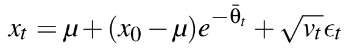
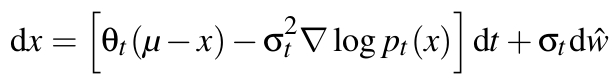
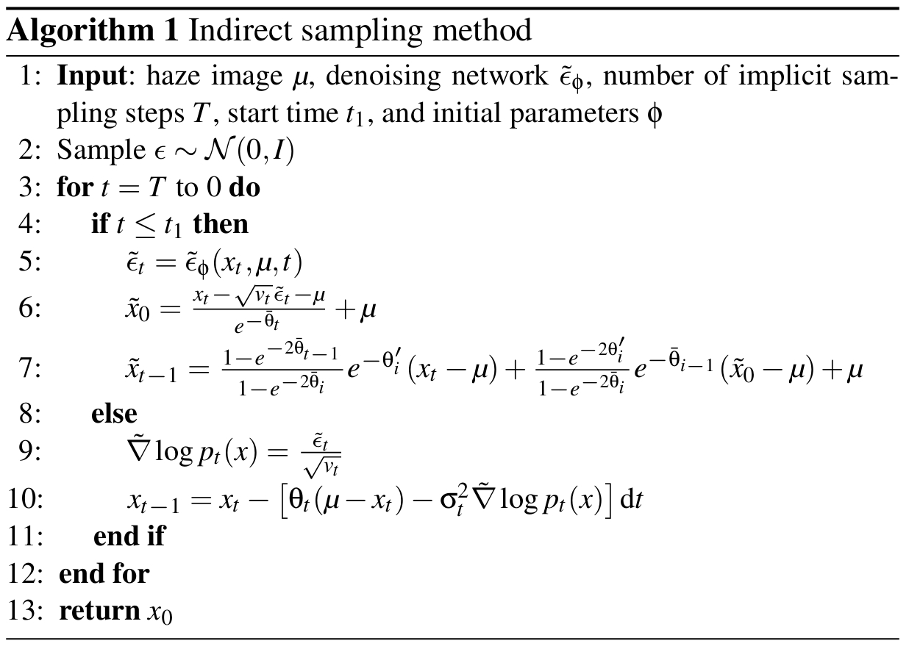

`train.py`中进行数据集的导入和训练控制

```python
from models import get_model
from datasets import get_dataloader

# 1. 初始化模型
model = get_model(config)

# 2. 加载数据
train_loader = get_dataloader(config['datasets']['train'])
valid_loader = get_dataloader(config['datasets']['valid'])

# 3. 开始训练
model.train(train_loader, valid_loader)

```

在`DensityAwareDiffusionModel.py`中定义了整个DADNet。

可以调用 `get_net` 创建网络，`IRSDE` 定义了正向和逆向扩散的数学逻辑，实现位于 `SDE.py` 文件
使用 `Lion` 优化器（定义于 `optimizer.py`）加速收敛

```python
class DensityAwareDiffusionModel():
    def __init__(self, opt, trainflag=True):
        self.net = get_net(opt['net_G'])  # 初始化去雾网络 DADNet
        self.sde = IRSDE(opt['sde'], self.device)  # 初始化扩散模型 IRSDE
        if trainflag:
            self.criterion = nn.L1Loss()  # 损失函数
            self.optim = Lion(self.net.parameters(), lr=opt['train_params']['lr'])  # 使用 Lion 优化器
        self._compile()

```

`SDE.py`定义了正向扩散，模拟图像从清晰到有雾的退化过程。输入清晰图像 X0，使其变成有雾图像Xt



```python
def forward(self, x0, T=-1):
    T = self.T if T < 0 else T
    x = x0.clone()
    for t in tqdm(range(1, T + 1)):
        x = self.forward_step(x, t)  # 逐步退化图像
    return x

```

 `SDE.py`定义了逆向扩散，使用 DADNet 在每个时间步逐步去噪，最终恢复清晰图像。



```python
def reverse_sde(self, xt, T=-1):
    T = self.T if T < 0 else T
    x = xt.clone()
    for t in tqdm(reversed(range(1, T + 1))):  # 从最后一个时间步逐步逆推
        score = self.score_fn(x, t)  # 使用 DADNet 估计噪声得分
        x = self.reverse_sde_step(x, score, t)  # 去除当前噪声
    return x

```

`DADNet.py`定义了DADNet在逆向扩散中估计每一步的噪声并逐步去雾。

其中`CDEMoudle`：融合暗通道图和输入图像，生成雾密度特征

```python
class CDEMoudle(nn.Module):  # 密度感知模块
    def forward(self, inp, dark):
        x1 = self.layer1(inp)  # 图像特征
        x2 = self.layer2(dark)  # 暗通道特征
        
        x = torch.concat([x1, x2], dim=1)
        x1 = self.layer3(x)
        x2 = self.layer4(x)

        x = self.conv3(torch.concat([x1, x2], dim = 1))

        return x
```

`DFFBlock`：结合时间步信息和密度特征逐步优化图像细节。

```python
class DFFBlock(nn.Module):  # 特征融合模块
    #def forward(self, x):
        #inp, time, dark = x
        #x = torch.cat([inp, self.dfeunit(inp * dark)], dim=1)  # 提取关键特征
        #x = self.mlp1(x)
        #x = torch.cat([x, self.hfounit(x, dark)], dim=1)  # 融合上下文信息
        #return self.mlp2(x)
    
    def forward(self, x):

        inp, time, dark = x

        shift_att, scale_att, shift_ffn, scale_ffn, shift_dark, scale_dark = self.time_forward(time, self.mlp3)
        
        # dark infor
        dark = dark * (scale_dark + 1) + shift_dark

        x = inp
        identity = x
        x = self.norm1(x)
        # MLP Time
        x = x * (scale_att + 1) + shift_att

        x = torch.cat([x, self.dfeunit(x * dark)], dim=1) # 提取关键特征
        x = self.mlp1(x)
        x = identity + x

        identity = x
        x = self.norm2(x)
        # MLP Time
        x = x * (scale_ffn + 1) + shift_ffn

        x = torch.cat([x, self.hfounit(x, dark)], dim=1) # 融合上下文信息
        x = self.mlp2(x)
        x = identity + x

        return x
```

`DensityAwareDiffusionModel.py`定义了模型具体训练过程

输入有雾图像和清晰图像，生成噪声状态。

使用 DADNet 估计噪声，计算预测噪声和真实噪声的 L1 损失。

使用优化器更新参数，调度器调整学习率。

```python
def train(self, train_loader, valid_loader):

    for j, (haze, clear, _) in enumerate(train_loader):
        current_iter += 1

        timesteps, states, _ = self.sde.generate_random_states(x0=clear, mu=haze)

        if self.use_cuda:
            haze = haze.cuda()
            clear = clear.cuda()
            timesteps = timesteps.cuda()

        self.optim.zero_grad()
        self.sde.set_mu(haze)
        with autocast(True):
            noise = self.sde.noise_fn(states, timesteps.squeeze())
            score = self.sde.get_score_from_noise(noise, timesteps)
            xt_1_expection = self.sde.reverse_sde_step_mean(states, score, timesteps)
            xt_1_optimum = self.sde.reverse_optimum_step(states, clear, timesteps)
            loss = self.criterion(xt_1_expection, xt_1_optimum)

```

`DensityAwareDiffusionModel.py`模型预测过程如下

输入有雾图像。

使用 `reverse_sde_ori_val` 逐步去除噪声。

输出清晰图像，并计算 PSNR 和 SSIM 等评价指标。

```python
def test(self, val_data_loader, save_tag=True , type=None, r=55, num=500, range_center=23):

    for i, (haze, clear, haze_name) in enumerate(val_data_loader):

        noisy_state = self.sde.noise_state(haze_pad)

        if type == 'ori':
            dehaze = self.sde.reverse_sde_ori_val(noisy_state, save_dir='nh2_10', save_states=True, r=r)
        elif type == 'imp' or type == 'final':
            dehaze = self.sde.reverse_sde_imp_val(noisy_state, save_dir=save_dir, save_states=False, r=r)

```


论文中分了两阶段进行去雾，第一阶段直接去雾，第二阶段为了避免过度去雾使用了间接去雾。在代码实现中，间接去雾和直接去雾通过不同的逆向扩散过程（`reverse_sde` 方法）体现。



`SDE.py`中的直接去雾

仅在关键时间步（t＞r）进行优化采样

```python
def reverse_sde_ori_val(self, xt, T=-1, save_states=False, save_dir='sde_state', r=100, center=1, **kwargs):
    T = self.T if T < 0 else T
    x = xt.clone()

    for t in tqdm(reversed(range(1, T + 1))):  # 从最后一个时间步开始逐步去噪
        noise, score = self.score_fn(x, t, **kwargs)
        x = self.reverse_sde_step(x, score, t)  # 使用标准逆扩散公式

        if save_states:  # 可选保存中间状态
            interval = self.T // 100
            if t % interval == 0:
                idx = t // interval
                os.makedirs(save_dir, exist_ok=True)
    return x

```

`SDE.py`中的间接去雾

仅在关键时间步（t≤r）进行优化采样

```python
def reverse_sde_imp_val(self, xt, T=-1, save_states=False, save_dir='sde_state', r=100, center=1, **kwargs):
    T = self.T if T < 0 else T
    x = xt.clone()

    for t in tqdm(reversed(range(center, T + 1))):  # 从关键时间步开始处理
        noise, score = self.score_fn(x, t, **kwargs)
        x0_hat = self.get_x0(x, noise, t)  # 估计清晰图像

        if t <= r:  # 在关键时间步优化采样
            x = self.reverse_optimum_step(x, x0_hat, t)
        else:  # 其他时间步使用标准逆扩散
            x = self.reverse_sde_step(x, score, t)

        if save_states:  # 可选保存中间状态
            interval = self.T // 100
            if t % interval == 0:
                idx = t // interval
                os.makedirs(save_dir, exist_ok=True)
                tvutils.save_image(x.data, '{}/state_{:0>2d}.png'.format(save_dir, idx), normalize=False)
    return x0_hat

```

